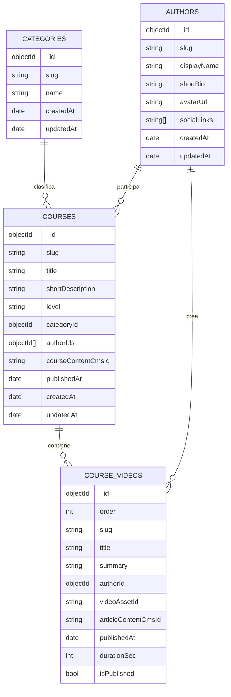

# Diagrama modelo documental (parte obligatoria)

```mermaid
erDiagram
    CATEGORIES ||--o{ COURSES : clasifica
    AUTHORS ||--o{ COURSES : participa
    COURSES ||--o{ COURSE_VIDEOS : contiene
    AUTHORS ||--o{ COURSE_VIDEOS : crea

    CATEGORIES {
      objectId _id
      string slug
      string name
      date createdAt
      date updatedAt
    }

    AUTHORS {
      objectId _id
      string slug
      string displayName
      string shortBio
      string avatarUrl
      string[] socialLinks
      date createdAt
      date updatedAt
    }

    COURSES {
      objectId _id
      string slug
      string title
      string shortDescription
      string level
      objectId categoryId
      objectId[] authorIds
      string courseContentCmsId
      date publishedAt
      date createdAt
      date updatedAt
    }

    COURSE_VIDEOS {
      objectId _id
      int order
      string slug
      string title
      string summary
      objectId authorId
      string videoAssetId
      string articleContentCmsId
      date publishedAt
      int durationSec
      bool isPublished
    }
```

> Nota: `COURSE_VIDEOS` representa el array embebido `videos[]` dentro de `courses`.
