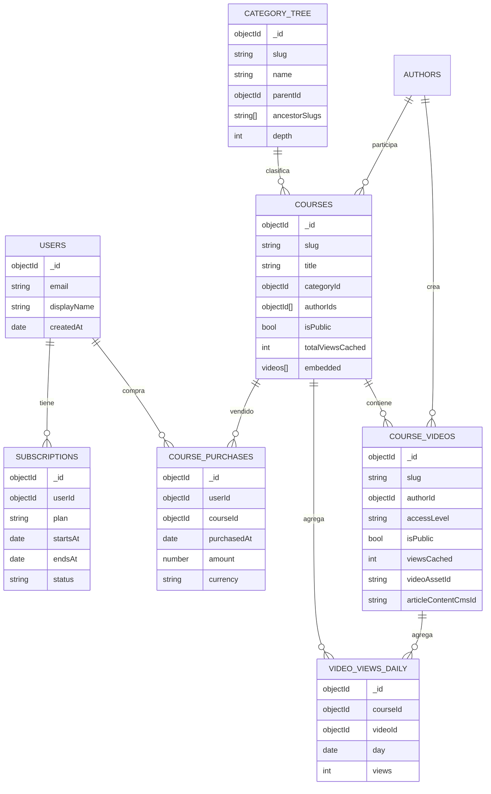

# Diagrama modelo documental (parte opcional)

```mermaid
erDiagram
    CATEGORY_TREE ||--o{ COURSES : clasifica
    AUTHORS ||--o{ COURSES : participa
    USERS ||--o{ SUBSCRIPTIONS : tiene
    USERS ||--o{ COURSE_PURCHASES : compra
    COURSES ||--o{ COURSE_PURCHASES : vendido
    COURSES ||--o{ COURSE_VIDEOS : contiene
    AUTHORS ||--o{ COURSE_VIDEOS : crea
    COURSES ||--o{ VIDEO_VIEWS_DAILY : agrega
    COURSE_VIDEOS ||--o{ VIDEO_VIEWS_DAILY : agrega

    CATEGORY_TREE {
      objectId _id
      string slug
      string name
      objectId parentId
      string[] ancestorSlugs
      int depth
    }

    USERS {
      objectId _id
      string email
      string displayName
      date createdAt
    }

    SUBSCRIPTIONS {
      objectId _id
      objectId userId
      string plan
      date startsAt
      date endsAt
      string status
    }

    COURSE_PURCHASES {
      objectId _id
      objectId userId
      objectId courseId
      date purchasedAt
      number amount
      string currency
    }

    COURSES {
      objectId _id
      string slug
      string title
      objectId categoryId
      objectId[] authorIds
      bool isPublic
      int totalViewsCached
      videos[] embedded
    }

    COURSE_VIDEOS {
      objectId _id
      string slug
      objectId authorId
      string accessLevel
      bool isPublic
      int viewsCached
      string videoAssetId
      string articleContentCmsId
    }

    VIDEO_VIEWS_DAILY {
      objectId _id
      objectId courseId
      objectId videoId
      date day
      int views
    }
```

> `CATEGORY_TREE` permite jerarquías (`Front End > React > Testing`).
> `accessLevel` en vídeo: `public`, `subscribers`, `purchased`.
